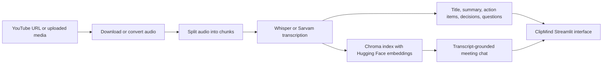

# ClipMind


**Turn meeting recordings into clear notes and useful answers.** ClipMind transcribes audio or video, creates structured meeting notes, and lets you ask questions grounded in the transcript.

## What it does

- Accepts a YouTube URL or an uploaded audio/video recording.
- Transcribes English audio with OpenAI Whisper. Hinglish mode uses Sarvam Speech-to-Text Translate and returns an English transcript.
- Generates a meeting title, a concise summary, action items, key decisions, and open questions.
- Builds a transcript search index and answers follow-up questions using relevant transcript sections.
- Shows progress through audio preparation, transcription, note generation, and chat setup.
- Removes uploaded, downloaded, converted, and chunked audio files after processing. Results are kept in the active app session and are not stored as a meeting library.

## How it works



## Technology

| Area | Tools |
| --- | --- |
| Interface | Streamlit, custom CSS, SVG branding |
| Audio and video | yt-dlp, FFmpeg, pydub, imageio-ffmpeg |
| English transcription | OpenAI Whisper |
| Hinglish transcription | Sarvam Speech-to-Text Translate API |
| Summaries and analysis | LangChain with Groq, Mistral, or Gemini |
| Transcript retrieval | Chroma, Hugging Face sentence-transformers (`all-MiniLM-L6-v2`) |
| Hosting | Streamlit Community Cloud; local use is also supported |

## Run locally

### Requirements

- Python 3.11 recommended
- A key for one supported language model provider: Groq, Mistral, or Gemini
- A Sarvam API key only if you want to use Hinglish transcription

### Install

```bash
git clone https://github.com/lakshya161234/video-analyser.git
cd video-analyser
python3.11 -m venv .venv
source .venv/bin/activate
python -m pip install --upgrade pip
pip install -r requirements.txt
```

Create a `.env` file in the project root. For Groq, for example:

```env
LLM_PROVIDER=groq
GROQ_API_KEY=your-groq-api-key
GROQ_MODEL=openai/gpt-oss-20b
SARVAM_API_KEY=your-sarvam-api-key
```

`SARVAM_API_KEY` is only needed for Hinglish mode. Choose one LLM provider:

| Provider | Environment settings |
| --- | --- |
| Groq | `LLM_PROVIDER=groq`, `GROQ_API_KEY=...`; optional `GROQ_MODEL` |
| Mistral | `LLM_PROVIDER=mistral`, `MISTRAL_API_KEY=...`; optional `MISTRAL_MODEL` |
| Gemini | `LLM_PROVIDER=gemini`, `GOOGLE_API_KEY=...`; optional `GEMINI_MODEL` |

Then start ClipMind:

```bash
streamlit run app.py
```

Open the local URL printed by Streamlit. Never commit `.env` or put real API keys in source code.

## Deploy on Streamlit Community Cloud

1. Push this repository to GitHub.
2. In Streamlit Community Cloud, create an app from the repository and select `app.py` as the entry point.
3. Add the required provider keys in the app's **Secrets** settings. Use TOML syntax, for example:

   ```toml
   LLM_PROVIDER = "groq"
   GROQ_API_KEY = "your-groq-api-key"
   GROQ_MODEL = "openai/gpt-oss-20b"
   SARVAM_API_KEY = "your-sarvam-api-key"
   ```

4. Deploy. Streamlit installs Python dependencies from `requirements.txt` and the system FFmpeg package from `packages.txt`.

Hosted services may be blocked from downloading some YouTube videos. If a URL fails, upload the media file instead. Uploaded media works independently of YouTube's download restrictions.

## Data handling and model routing

- English audio is transcribed by Whisper running on the app host. Hinglish audio is sent to Sarvam for transcription and translation.
- Transcript text is sent to the configured Groq, Mistral, or Gemini provider to generate notes and answer questions.
- Audio files and intermediate chunks are stored in a per-analysis temporary directory and removed when processing finishes or fails.
- Meeting results and chat history live in the active Streamlit session; ClipMind does not currently provide persistent accounts or a saved-meetings library.

## Resume summary

**ClipMind** is a meeting-intelligence application that converts recordings into transcripts, summaries, action items, decisions, and open questions, then supports transcript-grounded follow-up questions.

### Resume bullet examples

- Built **ClipMind**, a Streamlit application that turns YouTube links and uploaded recordings into transcripts, structured meeting summaries, action items, decisions, and open questions.
- Integrated Whisper and Sarvam transcription with configurable Groq, Mistral, and Gemini LLM backends for English and Hinglish meeting workflows.
- Implemented retrieval-augmented meeting Q&A using LangChain, Chroma, and Hugging Face embeddings to ground answers in relevant transcript passages.
- Added chunked audio processing, live pipeline progress, cloud deployment support, clear failure handling, and automatic cleanup of temporary media files.

### Project highlights

- **End-to-end workflow:** recording in, actionable meeting notes and transcript chat out.
- **Grounded Q&A:** retrieves transcript passages before answering, with instructions to report when the transcript does not contain an answer.
- **Flexible providers:** model provider and model can be configured without changing application code.
- **Deployment-aware:** supports Streamlit Cloud and local hosting, with FFmpeg setup and a user-facing note about YouTube restrictions on cloud hosts.
- **Temporary media handling:** audio intermediates are cleaned up after each analysis rather than accumulated in a downloads folder.

## Repository layout

```text
app.py                 Streamlit user interface and pipeline orchestration
core/                  Transcription, LLM, summaries, extraction, and retrieval
utils/audio_processor.py  Audio/video download, conversion, chunking, cleanup
assets/                ClipMind logo and visual assets
requirements.txt       Python dependencies
packages.txt           System packages for Streamlit Cloud (FFmpeg)
DEPLOYMENT.md          Deployment notes
```
